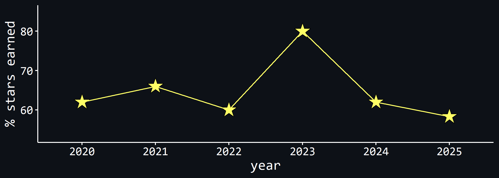

# Advent of Code 2025

This repo contains my solutions for the [Advent of Code
2025](https://adventofcode.com/2025) in `R`. Note that I don’t share my
inputs, as requested in the [AoC About
section](https://adventofcode.com/2025/about).

Here’s my past performance (and this year’s performance, so far). Note
that in 2025, there were 12 instead of 25 puzzles (i.e., 24 instead of
50 gold stars to earn). This is why I display the performance as % stars
earned.

## TOC

Here is a table of contents showing you what each day was about, along
with the run time. It’s a crude measure, where I simply calculate the
difference in `Sys.time()` at the beginning and the end of part 1, and
the beginning and end of part 2. That means in some occasions, the
runtime for part 2 will be much shorter because part of the code needed
to solve part 2 was already run in part 1. Reading in the data (and
sometimes, basic preprocessing that has nothing to do with the puzzle
solution) is excluded from the run time calculations.

| Day | Title               | Run Time               |
|-----|---------------------|------------------------|
| 1   | Secret Entrance     | 0.30 / 120.91 ms       |
| 2   | Gift Shop           | 2.97 s / 4.75 mins :-( |
| 3   | Lobby               | 15.11 / 15.43 ms       |
| 4   | Printing Department | 0.19 / 3.63 s          |
| 5   | Cafeteria           | 86.01 / 84.8 ms        |
| 6   | Trash Compactor     | 6.21 / 59.7 ms         |
